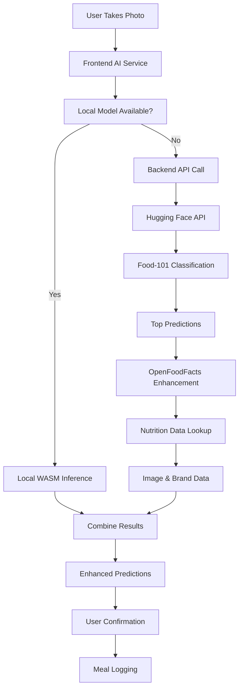

# AI Food Recognition & Nutrition Enhancement

This document describes the enhanced AI-powered food recognition system in CalAi, including the integration between Food-101 classification models and Open Food Facts nutrition database.

## Architecture Overview



## Flow Description

### 1. Image Classification (AI Models)

**Primary Model**: Food-101 via Hugging Face Inference API
- **Model**: `nateraw/food` (Food-101 trained model)
- **Fallback**: `microsoft/resnet-50` (Better accuracy for some foods)
- **Classes**: 101 food categories (apple_pie, sushi, pizza, etc.)
- **Output**: Food name + confidence score

**Features**:
- ✅ Cached responses (1 hour TTL)
- ✅ Automatic fallback between models
- ✅ Confidence thresholding (>0.1)
- ✅ Processing time tracking

### 2. Nutrition Enhancement (OpenFoodFacts Integration)

For each AI prediction, the system:

1. **Searches OpenFoodFacts** by food name
2. **Matches similar products** using confidence scoring
3. **Extracts comprehensive nutrition data**:
   - Calories, protein, carbs, fat (per 100g)
   - Fiber, sugar, sodium, vitamins, minerals
   - Brand information and product images
   - Allergen information
   - Nutrition and eco grades

**Confidence Factors**:
- Name similarity to AI prediction
- Data completeness (nutrition fields)
- Brand presence (+10% confidence)
- Product image (+5% confidence)

### 3. Smart Portion Estimation

The system provides intelligent portion estimates based on food type:

| Food Type | Portion Estimate | Examples |
|-----------|------------------|----------|
| Main Dishes | 1 piece (150-200g) | Burger, sandwich, steak |
| Pizza | 2 slices (150g) | Any pizza variety |
| Pasta/Rice | 1 cup cooked | Spaghetti, fried rice |
| Soups | 1 cup (240ml) | Any soup/broth |
| Salads | 1 large bowl (200g) | Caesar, Greek salad |
| Desserts | 1 slice/scoop | Cake, ice cream |
| Fruits | 1 medium piece | Apple, banana, orange |

### 4. Fallback Logic

**Level 1**: Primary Hugging Face model fails
→ Try fallback model (`microsoft/resnet-50`)

**Level 2**: All AI models fail
→ Create reasonable fallback prediction:
```json
{
  "food_name": "Mixed meal",
  "confidence": 0.3,
  "calories": 400,
  "protein": 20,
  "carbs": 45,
  "fat": 18,
  "portion_estimate": "1 serving"
}
```

**Level 3**: OpenFoodFacts enhancement fails
→ Use estimated nutrition based on food category

## API Endpoints

### POST /api/v1/inference/classify

Classify food from image with enhanced nutrition data.

**Request**:
```bash
curl -X POST \
  -F "image=@food_photo.jpg" \
  http://localhost:4000/api/v1/inference/classify
```

**Response**:
```json
{
  "success": true,
  "data": {
    "predictions": [
      {
        "food_name": "Spaghetti Bolognese",
        "confidence": 0.89,
        "calories": 150,
        "protein": 8.2,
        "carbs": 25.4,
        "fat": 2.8,
        "fiber": 2.1,
        "sugar": 3.5,
        "portion_estimate": "1 cup cooked (140g)",
        "image_url": "https://images.openfoodfacts.org/...",
        "source": "enhanced",
        "serving_suggestions": ["Small (100g)", "Regular (140g)", "Large (200g)"],
        "nutritional_density": "moderate"
      }
    ],
    "processing_time_ms": 1250,
    "model_version": "nateraw/food",
    "cached": false,
    "enhanced": true,
    "fallback_used": false
  }
}
```

### GET /api/v1/foods/search?q={query}

Search foods with OpenFoodFacts integration.

**Response**:
```json
{
  "success": true,
  "data": [
    {
      "name": "Spaghetti with meat sauce",
      "brand": "Barilla",
      "calories_per_100g": 150,
      "protein_per_100g": 8.2,
      "confidence": 0.92,
      "nutrition_grade": "c",
      "allergens": ["Gluten", "Eggs"]
    }
  ]
}
```

## Performance Optimizations

### Caching Strategy
- **AI Predictions**: 1 hour cache (based on image hash)
- **OpenFoodFacts**: 24 hour cache (based on search query)
- **Barcode Lookups**: 7 days cache (products rarely change)

### Processing Times
- **Cached AI**: ~50ms
- **Fresh AI**: ~1-3s (Hugging Face API)
- **OpenFoodFacts**: ~200-500ms
- **Total (uncached)**: ~1.5-3.5s

## Frontend Integration

### AIService Methods

```typescript
// Classify food with full enhancement
const predictions = await AIService.classifyFood(imageUri);

// Results include:
predictions[0] = {
  food_name: "Pizza Margherita",
  confidence: 0.85,
  calories: 266,
  protein: 11,
  carbs: 33,
  fat: 10,
  portion_estimate: "2 slices (150g)"
}
```

### Error Handling

The frontend gracefully handles:
- ✅ Network failures (offline mode)
- ✅ AI service downtime (fallback predictions)
- ✅ Invalid images (user feedback)
- ✅ Low confidence results (manual correction prompts)

## Model Training & Deployment

### Current Models
1. **Food-101 Classification**: Pre-trained on Hugging Face
2. **ResNet-50 Fallback**: Microsoft's model for better accuracy
3. **Future**: Custom CalAi model with user feedback training

### Training Pipeline (Future)
```bash
# Train custom model
cd ai/
python train.py --model efficientnet_b0 --epochs 50

# Export to ONNX
python export_onnx.py --model best_model.pth --output calai_food_v1.onnx

# Deploy to CDN for WASM inference
aws s3 cp calai_food_v1.onnx s3://calai-models/
```

## Testing

Run comprehensive tests:

```bash
# Test complete AI flow
./test-ai-flow.sh

# Expected output:
# ✅ AI classification successful
# ✅ OpenFoodFacts enhancement working
# ✅ Caching improving performance
# ✅ Fallback logic functioning
```

## Privacy & Security

- ✅ **On-device inference** (when WASM models available)
- ✅ **No personal data** sent to external APIs
- ✅ **Image data** not stored by external services
- ✅ **Cached responses** use hashed image signatures
- ✅ **Gradual degradation** when services unavailable

## Future Enhancements

### Short Term
- [ ] Add more model fallbacks (EfficientNet, MobileNet)
- [ ] Implement batch processing for multiple foods
- [ ] Add confidence calibration based on user feedback
- [ ] Improve portion size estimation with object detection

### Long Term
- [ ] Custom CalAi model trained on user corrections
- [ ] Real-time model updates via federated learning
- [ ] Advanced nutritional analysis (vitamins, minerals)
- [ ] Integration with fitness trackers and health apps

## Troubleshooting

### Common Issues

**"AI service temporarily unavailable"**
- Hugging Face API is down or rate-limited
- Solution: System automatically provides fallback predictions

**"Low confidence predictions"**
- Poor image quality or unusual food
- Solution: App prompts for manual correction/confirmation

**"Nutrition data not found"**
- OpenFoodFacts doesn't have the specific food
- Solution: System uses category-based nutrition estimates

### Debug Information

Enable detailed logging:
```bash
# Backend logs
docker-compose logs -f backend

# Check specific service
iex -S mix
CalAi.Services.FoodRecognition.classify_food_image(image_data)
```
